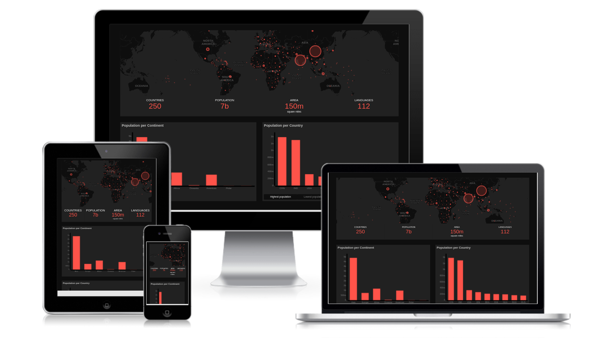

# World Population Dashboard (example app)

This repository holds an example app in the form of a dashboard. You can view information on the population in all countries in the world. This dashboard provides some insights, but that is not the main goal of this project. The main goal is to show how I would create a dashboard like this and what techniques I would use.

## Getting Started

First, fork the repository at:

`https://github.com/davebitter/example_app`

Then open up your terminal and clone the forked repository

`git clone https://github.com/[YOUR_USERNAME]/example_app.git`

Enter the directory

`cd assignment`

Install all the dependencies

`npm i`

Run the project

`npm start`

Finally, open up your browser at
<a href='http://localhost:3000'>http://localhost:3000</a>

## Demo

Do you want gain some insights in the world's population? Cool, you can view the demo at [https://world.davebitter.com](https://world.davebitter.com).

## Folder structure

The folder structure of this project is pretty straight forward. In `src/index.js` you will find the mounting point of the app. In `src/js/` you will find all the components that are used. Note that I used the [Atomic Design](http://bradfrost.com/blog/post/atomic-web-design/) principal by the amazing Brad Forst. Altough this project has a small amount of components, following this principal will result in a well structured folders that make it easy to find each component for fellow developers that work with you.

## Techniques and Packages

### Create React App

I used Create React App to quickly setup this project. It ensure that I didn't have to spend time setting up the project which allowed me to spend all my time on creating the actual dashboard.

### Fetch

I used the fetch API to request data from the open API endpoint [REST Countries](https://restcountries.eu) to get some data to build a dashboard with. Fetch provides all the functionality I will need and prevents the need of using a NPM package like Request.js.

### Async/Await

I used Async/Await in order to make the API object in `src/js/lib/API.js`. By doing this I was able to turn my API call asynchronous. This is a neater way than using callbacks for these calls. Async/Await again prevents the need of using a NPM package like Async.js.

### Config based rendering

In order to keep the code as DRY as possible and make the low-level components as dumb as possible I used a config to render all the components from. With the config that you can find in `src/config.js` the app renders all the components without having to hard code anything. The config, for instance, contains titles, types, datapoints and subcomponents. This allows for easy updating of the application and user specific applications. You can imagine that you can save an altered config for a user that you can use when they login.

### ES6 all the way

This project is coded in ES6. This allows me to use the various functionalities that it offers. This, again, prevents the need of using packages. It also helps with more readable code in the form of ternaries, arrow functions, concatting, array manipulation, Object assign, spreading and more.

### CSS

I decided to use regular CSS instead of using SASS or LESS. This project needed minimal styling. Setting up SASS or LESS for just a few lines of styles was not necessary. CSS is powerfull enough for what I needed this project.

### Flexbox

I used flexbox to handle everything regarding layout. This allows for easily creating a layout and having everything perfectly aligned.

### Leaflet

I used Leaflet to build the map component. Leaflet is an amazing package where you have full control over each layer and marker. Together with a nice dark tilelayer this made for an eye-catching map component.

### C3.js

I used C3.js to build the charts. C3.js builds D3.js code for you from a config object that I can then hook up to the config for all the components. If you need to build specific functionailty you can always use D3.js to alter the charts. I used this because it offered everything I needed and was faster an easier to setup in this short project.

### Numeral.js

I used Numeral.js to format all the numeric values. I did this because this was the fastest and easiest way to ensure that the numbers would be perfectly formatted how big or small they may be.
